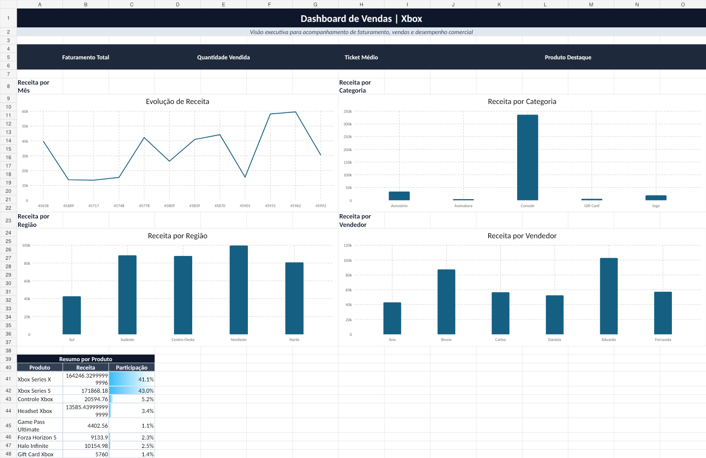

# Dashboard de Vendas no Excel

## Sobre o projeto

Este projeto apresenta um dashboard de vendas desenvolvido no Microsoft Excel, com foco em organização, análise e visualização de dados comerciais.

O objetivo é transformar dados brutos em informações claras, permitindo acompanhar o desempenho das vendas, identificar tendências e apoiar a tomada de decisão baseada em dados.

## Tecnologias utilizadas

- Microsoft Excel
- Tabelas
- Fórmulas
- Gráficos
- Indicadores de desempenho
- Organização visual de dashboard

## Indicadores apresentados

- Faturamento total
- Quantidade vendida
- Ticket médio
- Produto destaque
- Receita por mês
- Receita por categoria
- Receita por região
- Receita por vendedor
- Resumo por produto

## Estrutura do arquivo Excel

- `Base_Dados`: base com os registros de vendas.
- `Apoio`: tabelas auxiliares utilizadas nos cálculos e gráficos.
- `Dashboard`: painel visual final com KPIs e gráficos.
- `Instrucoes`: orientações para uso e reprodução do projeto.

## Como reproduzir

1. Baixe o arquivo `dashboard_vendas_excel.xlsx`.
2. Abra o arquivo no Microsoft Excel.
3. Acesse a aba `Dashboard` para visualizar o painel.
4. Para atualizar os dados, altere a aba `Base_Dados` mantendo os mesmos cabeçalhos.
5. Atualize as fórmulas e gráficos, se necessário.

## Preview

Adicione aqui uma imagem do dashboard após subir o projeto no GitHub.

Exemplo:

```md

```

## Autor

Rafael SV
